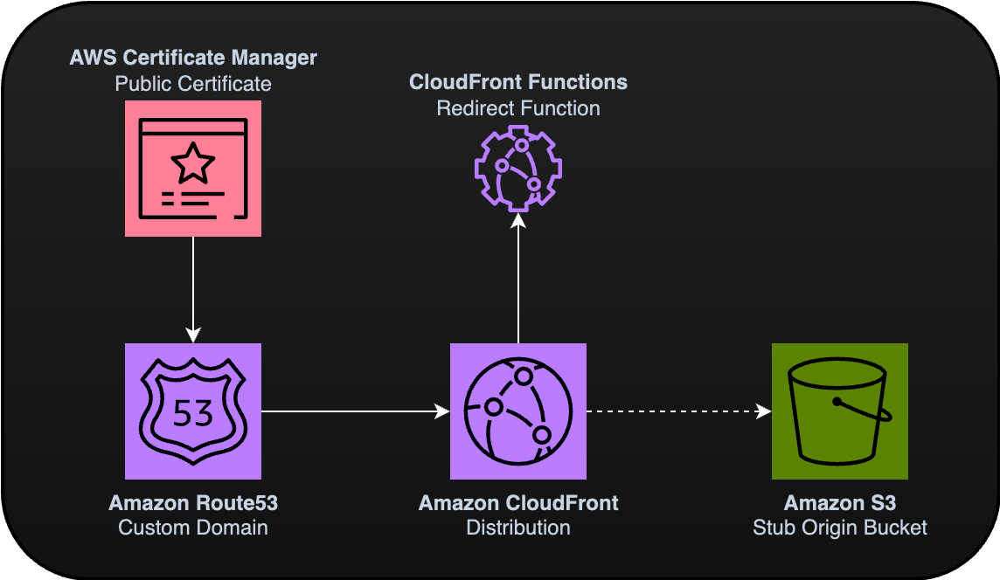

# CloudFrontRedirector-Construct

CDK Construct to simplify using CloudFront to redirect entire domains or back-half stubs.

 


## Concept

Needs to redirect domains or building custom link shorteners is a common pattern required by many different solutions. This project simplifies using Amazon CloudFront with CloudFront Functions to rewrite the requests, forwarding users to another location.



## Usage

This construct is able to either perform redirections for everything sent to a domain, or based on the back-half of the URL.

You might use this for something as simple as redirecting an unused `www` subdomain to a root apex, or for building your own link shortener service, similar to bit.ly.

For more details, check the auto-generated [API](API.md).

### Installation 
Before using this construct, you will need to import it for use in your AWS CDK stack.

```bash
# CDK for Typescript
npm install cdk-cloudfront-redirector
```

### Integrating

```typescript
import { RedirectionSite } from 'cdk-cloudfront-redirector';

// Basic Setup
const redirectBasic = new RedirectionSite(this, "RedirectionForWebsite", {
    targetUrl: "https://ssennett.net/",
});

// Advanced Setup
const redirectAdvanced = new RedirectionSite(this, "RedirectionForWebsite", {
    targetUrl: "https://github.com/ssennettau/CloudFrontRedirector-Construct",
    pathRedirects: [
        path: "/author",
        destination: "https://ssennett.net/",
    ],
    customDomain: {
        domainName: "cfrc.cc",
        hostedZone: "cfrc.cc",
    }
});

// Return outputs
new cdk.CfnOutput(this, "RedirectionUrl", { value: redirectAdvanced.cfDistributionUrl });
```

## License

All code in this project is licensed under the [MIT License](LICENSE).